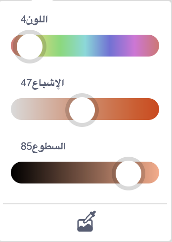
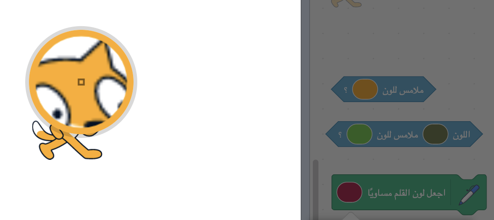

تسمح لك بعض الكتل في Scratch باختيار اللون.

```blocks3
<touching color (#20f73b) ?>

<color (#819322) is touching (#5fe98e) ?>

set pen color to (#e50820)
```

يمكنك اختيار لون يطابق اللون الذي يظهر على المنصة.

انقر فوق إدخال اللون لفتح منتقي الألوان ثم انقر فوق القطارة في الأسفل.



حرك مؤشر الماوس إلى الجزء الرئيسي وتحرك حوله حتى تحدد اللون الذي تريده ثم انقر (أو اضغط) لتحديد اللون.



سيتغير اللون في داخل الكتلة ليلائم اللون الذي اخترته. انقر في منطقة الشفرة البرمجية لإغلاق منتقي الألوان.

