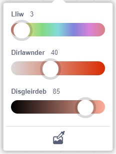
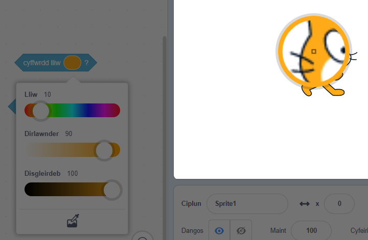

Mae rhai blociau yn Scratch yn caniatáu i ti ddewis lliw.

```blocks3
<touching color (#20f73b) ?>

<color (#819322) is touching (#5fe98e) ?>

set pen color to (#e50820)
```

Galli di ddewis lliw i gyd-fynd â lliw sy'n ymddangos ar y Llwyfan.

Clicia ar y mewnbwn lliw i agor y dewiswr lliwiau ac wedyn clicia ar y diferydd llygad ar y gwaelod.



Symuda bwyntydd y llygoden draw i'r Llwyfan a symud o gwmpas nes dy fod ti wedi dewis y lliw rwyt ti ei eisiau ac yna clicio (neu daro) i ddewis y lliw.



Bydd y lliw yn y mewnbwn bloc yn newid i gyd-fynd â'r lliw a ddewisaist. Clicia yn ardal y Cod i gau'r dewiswr lliwiau.

