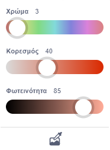
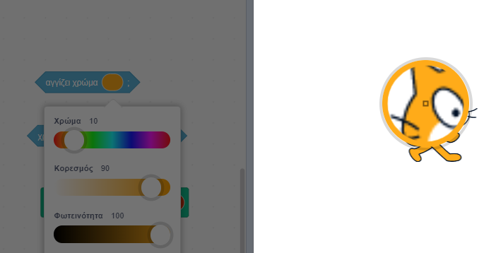

Ορισμένα μπλοκ στο Scratch σου επιτρέπουν να επιλέξεις ένα χρώμα.

```blocks3
<touching color (#20f73b) ?>

<color (#819322) is touching (#5fe98e) ?>

set pen color to (#e50820)
```

Μπορείς να επιλέξεις ένα χρώμα που ταιριάζει με ένα χρώμα που εμφανίζεται στο Σκηνικό.

Κάνε κλικ, στην εισαγωγή χρώματος για να ανοίξεις τον επιλογέα χρώματος και, στη συνέχεια, κάνε κλικ στο σταγονόμετρο στο κάτω μέρος.



Μετακίνησε τον δείκτη του ποντικιού στο Σκηνικό και μετακινήσου μέχρι να επιλέξεις το χρώμα που θέλεις και, στη συνέχεια, κάνε κλικ (ή πάτησε στην οθόνη) για να επιλέξεις το χρώμα.



Το χρώμα στο μπλοκ εισόδου θα αλλάξει για να ταιριάζει με το χρώμα που επίλεξες. Κάνε κλικ στην περιοχή του Κώδικα για να κλείσεις τον επιλογέα χρώματος.

