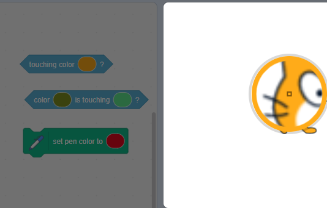

Algunos bloques en Scratch te permiten elegir un color.

```blocks3
<touching color (#20f73b) ?>

<color (#819322) is touching (#5fe98e) ?>

set pen color to (#e50820)
```

Puedes elegir un color que coincida con el color que aparece en el Escenario.

Haz clic en la configuración de color para abrir el selector de colores y luego haz clic en el gotero en la parte inferior.


Mueve el puntero del ratón sobre el Escenario hasta que hayas seleccionado el color que desees y luego haz clic (o pulsa) para seleccionar el color.



El color en el bloque cambiará para coincidir con el color que elegiste. Haz clic en el área de Código para cerrar el selector de colores.

