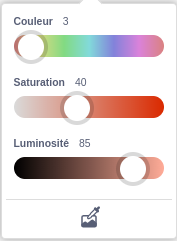
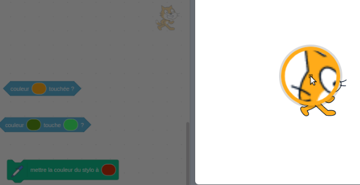

Certains blocs de Scratch permettent de choisir une couleur.

```blocks3
<touching color (#20f73b) ?>

<color (#819322) is touching (#5fe98e) ?>

set pen color to (#e50820)
```

Tu peux choisir une couleur correspondant à une couleur qui apparaît sur la scène.

Clique sur l'entrée de couleur pour ouvrir le sélecteur de couleur, puis clique sur la pipette en bas.



Déplace le pointeur de la souris sur la scène et déplace-toi jusqu'à ce que tu aies sélectionné la couleur souhaitée, puis clique (ou appuie) pour sélectionner la couleur.



La couleur dans l'entrée de bloc changera pour correspondre à la couleur que tu as choisie. Clique dans la zone Code pour fermer le sélecteur de couleurs.

