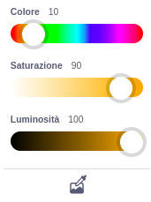

Alcuni blocchi in Scratch ti permettono di scegliere un colore.

```blocks3
<touching color (#20f73b) ?>

<color (#819322) is touching (#5fe98e) ?>

set pen color to (#e50820)
```

Puoi scegliere un colore che corrisponde a un colore che appare sullo stage.

Clicca sull'input dei colori per aprire il selettore del colore, poi clicca sul contagocce in basso.



Sposta il puntatore del mouse sullo stage e muovilo finché non trovi il colore che vuoi, poi clicca (o tocca) per selezionarlo.


Il colore nell'input del blocco cambierà per corrispondere al colore scelto. Clicca nell'area del Codice per chiudere il contagocce.

