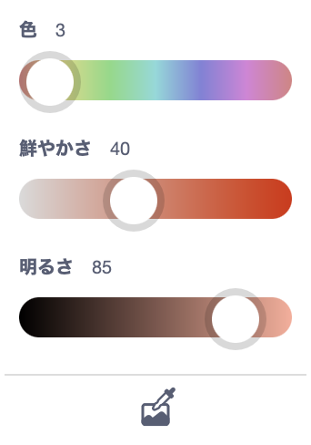
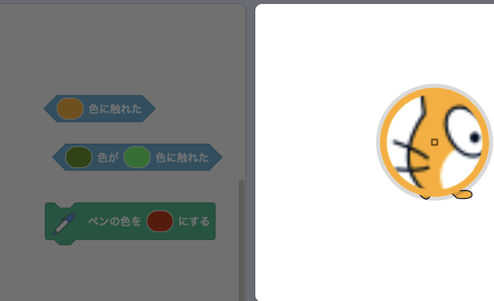

Scratchの一部のブロックでは、色を選択できます。

```blocks3
<touching color (#20f73b) ?>

<color (#819322) is touching (#5fe98e) ?>

set pen color to (#e50820)
```

ステージに表示されている色と一致する色を選択できます。

カラー入力をクリックしてカラーピッカーを開き、下部にあるスポイトをクリックします。



マウスポインターをステージに移動し、目的の色を選択するまで動かしてから、クリック（またはタップ）して色を選択します。



ブロック入力の色が選択した色に一致するように変更されます。 コード領域をクリックして、カラーピッカーを閉じます。
