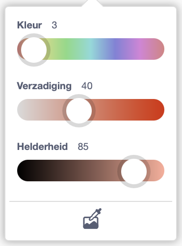
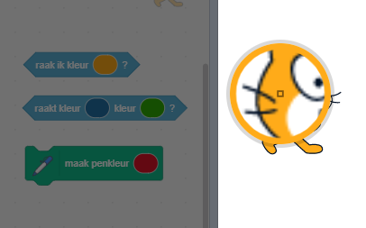

Bij sommige blokken in Scratch kun je een kleur kiezen.

```blocks3
<touching color (#20f73b) ?>

<color (#819322) is touching (#5fe98e) ?>

set pen color to (#e50820)
```

Je kunt een kleur kiezen die overeenkomt met een kleur die in het werkgebied wordt weergegeven.

Klik op de kleurinvoer om de kleurkiezer te openen en klik vervolgens op de pipet onderaan.



Beweeg je muis naar het werkgebied en beweeg totdat je de gewenste kleur hebt gevonden en klik (of tik) om de kleur te selecteren.



De kleur in de blokinvoer verandert in de kleur die je hebt gekozen. Klik in het Codegebied om de kleurkiezer te sluiten.
