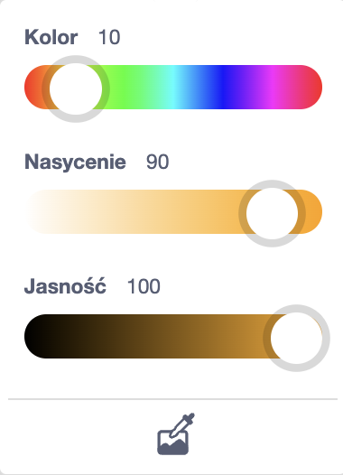
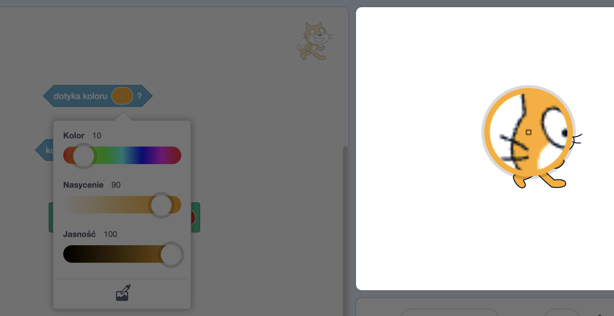

Niektóre bloki w Scratchu pozwalają wybrać kolor.

```blocks3
<touching color (#20f73b) ?>

<color (#819322) is touching (#5fe98e) ?>

set pen color to (#e50820)
```

Możesz wybrać kolor pasujący do tła sceny.

Kliknij na obszar koloru, aby otworzyć ustawienia koloru, a następnie kliknij ikonę próbnika koloru na dole.



Przesuń wskaźnik myszy na scenę i poruszaj się, aż wybierzesz żądany kolor, a następnie kliknij, aby zatwierdzić wybór koloru.



Obszar koloru zawarty w bloku zmieni się na wybrany kolor. Kliknij obszar kodu, aby zamknąć okno wyboru koloru.

