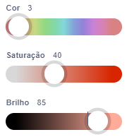

Alguns blocos no Scratch permitem que você escolha uma cor.

```blocks3
<touching color (#20f73b) ?>

<color (#819322) is touching (#5fe98e) ?>

set pen color to (#e50820)
```

Você pode escolher uma cor que corresponda à cor que aparece no Palco.

Clique na entrada de cor para abrir o seletor de cores e clique no conta-gotas na parte inferior.



Mova o ponteiro do mouse até o Palco e mova-o até selecionar a cor desejada e clique (ou toque) para selecionar a cor.


A cor na entrada do bloco mudará para corresponder à cor que você escolheu. Clique na área Código para fechar o seletor de cores.

