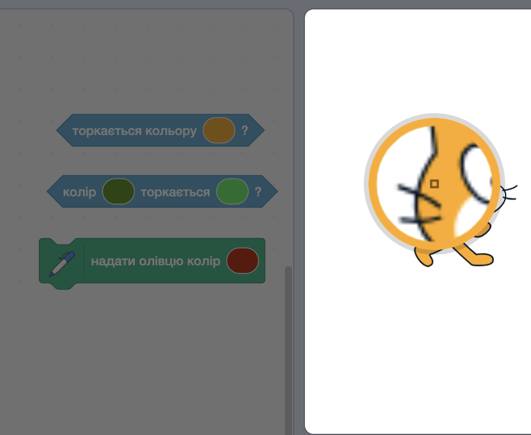

Деякі блоки в Скретчі дозволяють вибрати колір.

```blocks3
<touching color (#20f73b) ?>

<color (#819322) is touching (#5fe98e) ?>

set pen color to (#e50820)
```

Ти можеш вибрати колір, який відповідатиме кольору зі Сцени.

Клацни на поле вводу кольору, щоб відкрити панель вибору кольору, а далі клацни на піпетку внизу.


Перемісти вказівник миші на Сцену і рухай ним, доки не вибереш потрібний колір, а потім клацни (або торкнися), щоб вибрати цей колір.



Колір у полі вводу блока поміняється на обраний колір. Клацни в області Код, щоб закрити панель вибору кольору.

